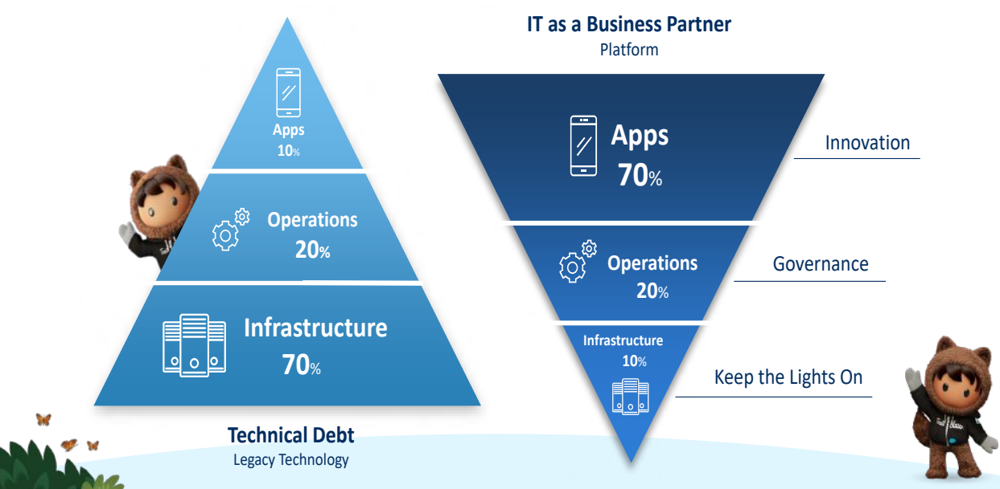
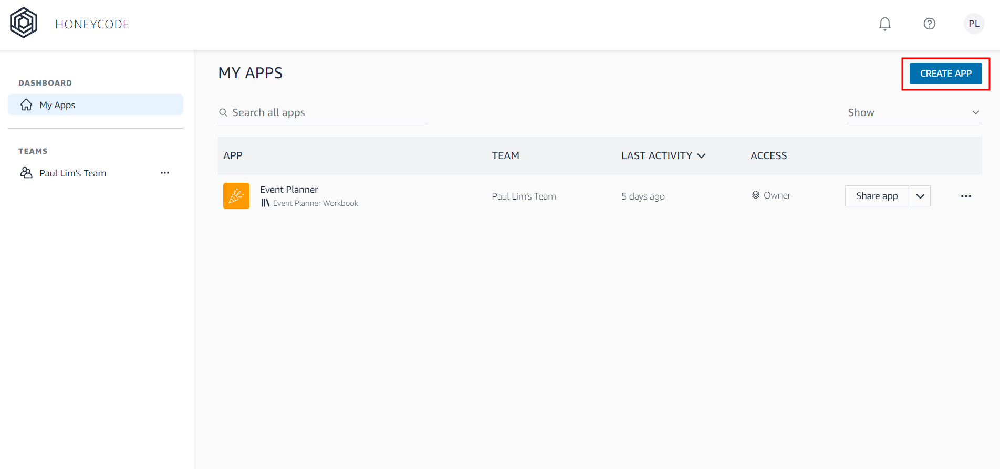
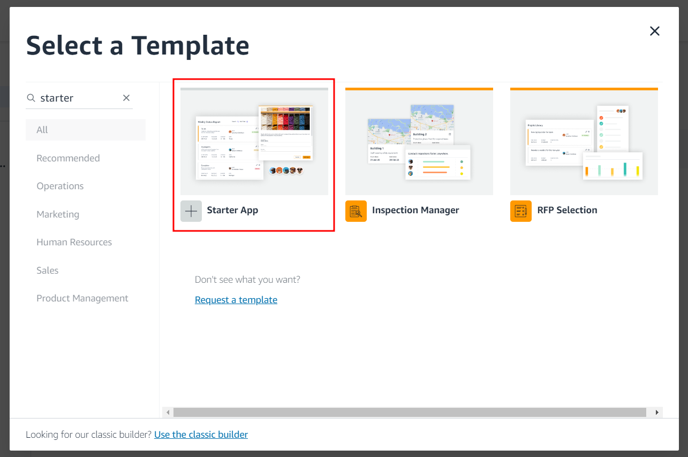
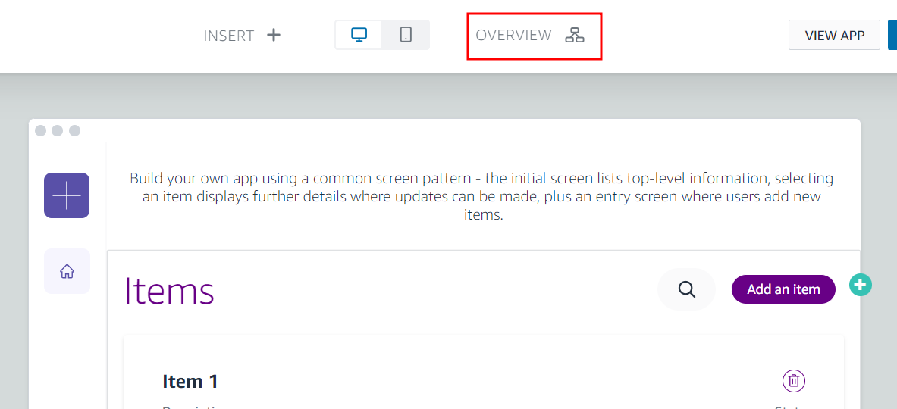
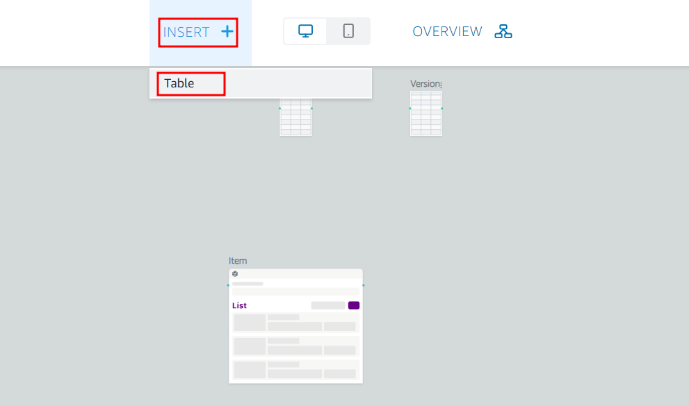

# [업무자동화] 업무효율성을 폭발적으로 높이는 업무자동화 애플리케이션 따라 만들기

  우리 회사에서 내가 필요한 어플리케이션을 손쉽게 만들 수 있다면 얼마나 좋을까요? 과거에는 회사에서 온프레미스 인프라와 운영에 많은 투자를 했습니다. 이로 인해 비즈니스 혁신을 위한 어플리케이션 개발과 유지보수에 투자할 여력이 부족했습니다. 그래서 IaaS와 PaaS와 같은 클라우드 솔루션이 등장하게 되어 인프라에 대한 비용 투자를 줄이고, 회사에 필요한 어플리케이션 개발에 더 많은 투자를 할 수 있게 되었습니다. 이는 고객에게 더 집중하여 비즈니스 역량을 강화할 수 있게 합니다. 
  
   [출처: Salesforce]

  비슷한 맥락에서, 글로벌 기업인 아마존, 마이크로소프트, 세일즈포스 등은 노코드 및 로코드 기반의 플랫폼을 제공하여 다양한 산업 분야에서 필요한 어플리케이션을 스스로 개발할 수 있는 서비스를 제공하고 있습니다. 이러한 서비스는 프로그래밍 지식이나 복잡한 개발 과정 없이도 사용자들이 원하는 기능과 비즈니스 프로세스를 쉽게 구현할 수 있게 도와줍니다. 이를 통해 기업은 비즈니스 요구에 맞춤형 어플리케이션을 빠르게 개발하고 활용할 수 있으며, 생산성을 향상시키고 비용을 절감할 수 있습니다. 

## 1. 아마존 허니코드로 사내행사 참가 여부를 조사하는 앱 만들기

    아마존 허니코드(Amazon Honeycode)는 모바일 웹 및 웹 앱을 제작할 수 있게 해주는 스프레드시트 지향 노코드 개발 플랫폼이다. 비전문 개발자도 코딩 없이 손쉽게 웹 및 모바일 애플리케이션을 구축할 수 있다. 액셀과 유사한 스프레드시트 스타일의 인터페이스를 제공하기 때문에 테이블, 데이터 입력 양식, 워크플로우 등을 시각적으로 구성하여 비즈니스 애플리케이션을 빠르게 만들 수 있다. AWS 클라우드에서 호스팅되므로 다른 AWS 서비스와의 연동이 용이하고, 안정성이 보장된다는 장점이 있다. 

### **Step1. 만들고자 하는 App을 정의**

  아마존 허니코드를 사용하면 액셀이나 이메일로 처리하던 작업들을 앱으로 자동화할 수 있습니다. 예를 들면 채팅이나 이메일로 했던 작업 요청 및 승인 과정을 앱을 대체할 수 있습니다. 혹은 공용 폴더에 엑셀로 관리하던 이벤트 기획 및 진행 상태 관리를 앱으로 대체할 수 있습니다. 
   
  이 글에서는 아마존 허니코드를 활용하여 '사내 행사를 위해 선착으로 신청을 받는 App'을 만드는 방법을 step-by-step으로 소개합니다. [2022 노코드/로우코드 자동화 컨퍼런스](https://itsight.zdnet.co.kr/conference/No_code-Low_code) 중 박기흥 님(솔루션즈 아키텍트)의 `No Code, Low Code on AWS` 발표를 참고했습니다.

  가장 먼저, 만들고자 하는 App은 무엇인지, 어떤 기능을 할 것인지 생각해보아야 합니다.

- 첫 화면에는 세미나 안내 및 소개 페이지를 표시할 것입니다. 
- 'Add(추가하기)' 버튼을 누르면 신청자 등록 Form에서 신청자 등록을 할 수 있으며, 이 Form에는 이름, Email. 직군(개발, 마케팅, 영업, 인사), 강사에게 바라는 점을 입력할 수 있습니다.
- 신청한 사람에게는 신청 성공 알림 이메일을 자동으로 발송할 것입니다. 
  
  

- 이후 step 을 진행하려면 [Amazon Honeycode 로그인](https://www.honeycode.aws/)이 필요합니다.

### **Step2. 데이터 모델을 정의하고 Table 생성**

  아마존 허니코드의 핵심은 `테이블(Table)`과 `자동화(Automation)`를 결합한 `스마트 워크플로우`입니다. 즉, Table 의 데이터가 자동으로 변경(추가/삭제/수정)되는 것을 감지하고 자동으로 해야 할 일(Actions)들을 지정함으로써 `스마트 워크플로우`를 만들 수 있습니다. 허니코드에서는 여러 앱과 이들 간의 워크플로우를 묶어 하나의 프로젝트로서 총체적으로 관리하는 개념을 `워크북(Workbook)`라고 부르고 있습니다. 
  
  그렇지만 사용자가 모든 것을 세팅하기에는 어려움이 따르기 때문에 허니코드에서는 여러 샘플 `템플릿(Templates)`을 제공하고 있습니다. 모든 템플릿 앱에는 샘플 데이터와 필수 표, 앱 화면, 공식, 데이터 분류 방식이 들어 있기 때문에 자체적인 앱을 곧바로 시작할 수 있습니다. 표에는 시작 데이터가 채워져 있고, 이용자는 특정 용도에 맞춰 이를 변경하면 됩니다.

  - Amazon Honeycode 메인 페이지에서 `Create App`을 누른 후 `Starter App` 템플릿을 선택해 봅시다.

    

      

          
      

      

          
      

    

  - Edit Screen → Overview → Insert Table → roles, attendees table 추가

    

      

          
      

      

          
      

    

    

      

          
      

      

          
      

    

### **Step3. App Builder를 이용해 User Interface 생성**

### **Step4. Automations과 workflows 추가**

  허니코드에서는 자동화가 일어날 때마다 (예. 앱 또는 표에서 무언가가 변경될 때) 웹훅을 추가해 데이터를 허니코드로부터 다른 온라인 서비스로 이동시킬 수 있습니다. 

### **Step5. 팀에 Share(배포), 변경 발생 시 Step1~5 반복**

  - My App에서 Share App 선택

  - App Link를 메일로 공유하거나 App 접근 권한을 Anyone이나 Team member로 설정하여 App 사용을 팀원에서 안내할 수 있습니다.

### **결론**

  아마존의 허니코드 노코드 앱 빌더를 이용하면 간단한 웹 및 모바일 웹 앱을 생성할 수 있습니다. 20여개의 템플릿은 신입 직원 수습, 구매 주문 승인 등 일반적인 소규모 팀 작업을 위한 소형 앱을 신속하게 제작할 수 있게 해줍니다. 아예 처음부터, 또는 기존의 CSV 파일로부터 앱을 제작할 수 있습니다. 하지만 '노코드' 빌더이기 때문에 본격적인 용도의 앱을 개발하려면 프로그래머, DBA, 여타 IT 전문가의 도움이 필요합니다. 

https://kiheung.notion.site/Amazon-Honeycode-ee3413c3c6194ec0bc44feb91e4e2703

## 2. 구글 클라우드 앱시트로

  우리 회

    앱시트(appsheet.com)는 모든 사람이 스스로 앱을 만들 수 있도록 하겠다는 '노코드 앱 플랫폼(no-code app platform)'을 목표로 2014년 시애틀에서 시작한 스타트업이다. 2020년 1월 구글이 인수하면서 구글 클라우드의 일부가 됐다.

https://www.ciokorea.com/news/179934#csidx36b2572ffe8e1a2b1fb15bd9a5b84cf 